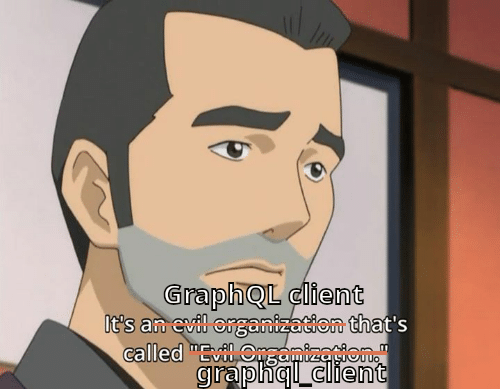

export { book as theme } from 'mdx-deck/themes'
import { Split } from 'mdx-deck/layouts'

hi

```notes
- name
- I want to talk about a small library I wrote
```

---

### What?



<div>
<small>
    a GraphQL client
</small>
</div>

```notes
- GraphQL client
```

---

### Why?

<video
    autoPlay
    loop
    src="./assets/cat-box.mp4"
/>

<div>
no graphql client in Rust
</div>

```notes
- If it fits, I sits
- I like GraphQL
- I had ideas about GraphQL servers
- Noticed there is no client in Rust
```

---

### pure Rust (?)

<!-- no js dependencies -->
<!-- insert line counts with json here -->

```
------------------------------------
 Language                    Lines
------------------------------------
 JSON                        47193
 Rust                         4782
------------------------------------
```

<small>counted with <a href="https://github.com/Aaronepower/tokei">tokei</a></small>

```notes
- impostor?
```

---

### Wait, what?

```notes
- Let's backtrack a bit
```

---


```notes
- Let's talk about GraphQL
- Who has worked or is familiar with GraphQL?
```


---


- Developed at Facebook
- Open sourced in 2015
- Spec defining two languages, a type system and the behaviour of servers
- A very rich, fast-growing ecosystem
- Fast adoption -> GitHub, Shopify, Facebook, Twitter...

```notes
- Technology for building APIs, with clients requesting data from a servers
- One query -> query a graph objecst and fields
- Fetch exactly what you need
- Nesting (post -> comment -> author -> posts)
```

---

Excellent tooling


---

Introspection!

```notes
- You can ask a server, at runtime, what API it exposes
- It returns a structured response you can generate code for a client from - think mini-SDK.
```

---

It has types!

```graphql
type Character {
  name: String!
  appearsIn: [Episode]!
}
```

```notes
- Cool, we can map that to a struct!
```

---

More types!

```graphql
type Starship {
  id: ID!
  name: String!
  length(unit: LengthUnit = METER): Float
}
```

```notes
- Every field can take arguments
```

---

Even more types!

```graphql
# In the schema
union SearchResult = Human | Droid | Starship
```

---

Query

```graphql
{
  search(text: "an") {
    ... on Human {
      name
      height
    }
    ... on Droid {
      name
      primaryFunction
    }
    ... on Starship {
      name
      length
    }
  }
}
```

---

Response (JSON)

```graphql
{
  "data": {
    "search": [
      {
        "name": "Han Solo",
        "height": 1.8
      },
      {
        "name": "Leia Organa",
        "height": 1.5
      },
      {
        "name": "TIE Advanced x1",
        "length": 9.2
      }
    ]
  }
}
```

---

A new challenger appears!

```graphql
interface Character {
  id: ID!
  name: String!
  friends: [Character]
  appearsIn: [Episode]!
}
```

---

```graphql
type Human implements Character {
  id: ID!
  name: String!
  friends: [Character]
  appearsIn: [Episode]!
  starships: [Starship]
  totalCredits: Int
}

type Droid implements Character {
  id: ID!
  name: String!
  friends: [Character]
  appearsIn: [Episode]!
  primaryFunction: String
}
```

---

```graphql
query HeroForEpisode($ep: Episode!) {
  hero(episode: $ep) {
    name
    ... on Droid {
      primaryFunction
    }
  }
}
```

---

```graphql
{
  "data": {
    "hero": {
      "name": "R2-D2",
      "primaryFunction": "Astromech"
    }
  }
}
```

---

### This is all very javascripty


```notes
- Challenge for the library: map that to nice Rust data structures
```

---

Interlude: what's the API?


```rust
#[derive(GraphQLQuery)]
#[graphql(
    schema_path = "src/graphql/schema.json",
    query_path = "src/graphql/queries/my_query.graphql",
)]
pub struct MyQuery

```

...

```rust
    // this is the important line
    let request_body = MyQuery::build_query(variables);

    let client = reqwest::Client::new();
    let mut res = client.post("/graphql").json(&request_body).send()?;
    let response_body: Response<my_query::ResponseData> = res.json()?;
```

```notes
- Build script and CLI codegen are WIP
```

---

```graphql
query MyQuery($page: Int!) {
    contacts(page: $page) {
        __typename
        name
        ... on Person {
            birthday
        }
        ... on Organization {
            industry
            members(minimumAge: 40) {
                birthday
                name
            }
        }
    }
}
```

```notes
- Even for a simple query, it's not obvious
- We have Person twice, with different fields
- Not options, that would not be nice
- We have to generate two Person structs
- Solution: paths in names
```

---

### serde

---

```rust
// union SearchResult = Human | Droid | Starship

#[derive(Deserialize)]
#[serde(tag = "__typename")]
enum SearchResult {
  OnHuman(SearchResultOnHuman),
  OnDroid(SearchResultOnDroid),
  OnStarship(SearchResultOnStarship),
}
```

<small>See <a href="https://serde.rs/enum-representations.html">enum representations</a> in the serde docs</small>


---

```graphql
query MyQuery {
  search(searchTerm: "Tatooine") {
    ...onHuman {
      name
    }
    ...onDroid {
      model
    }
    ...onStarship {
      engine { name }
    }
  }
}

```

```notes
- You _have_to include __typename
- And now for something completely different: interfaces
```

---

Interfaces

```graphql
query HeroQuery {
  hero(episode: JEDI) { # Character
    __typename # will return the concrete type
    name # part of Character
    ...on Human {
      hairColor
    }
  }
}
```

```notes
- Remember: this is what we write
```

---

```json
{
  "data": {
    "hero": {
      "__typename": "Human",
      "name": "Obi-Wan Kenobi",
      "hairColor": "WHITE"
    }
  }
}
```


```notes
- This is what we get
- We have the type! we can statically know which fields we will get.
```


---

```rust

#[derive(Deserialize)]
struct MyQueryHero { // Character
  typename: String,
  // common fields
  name: String,
  #[serde(flatten)]
  on: MyQueryHeroOn,
}

#[derive(Deserialize)]
#[serde(tag = "__typename")]
enum MyQueryHeroOn {
  Human(MyQueryHeroOnHuman),
  Droid,
  Starship,
}
```

```notes
- 'member
```

---

### Question to the audience

<video
    autoPlay
    loop
    src="./assets/intermission.mp4"
/>

---

if a GraphQL query wore pants...

---

would it wear them like this

```rust
fn call<Q>(
    &self,
    variables: &Q::Variables
) -> Future<GraphQLQueryResult>
where Q: GraphQLQuery
```
...
```rust

let response = await!(client.call::<RepositoriesIndex>(&variables));
```

---

or like this?

```rust
fn call<Q>(
    &self,
    query: Q,
    variables: &Q::Variables
) -> Future<GraphQLQueryResult>
where Q: GraphQLQuery
```
...

```rust
let response = await!(client.call(RepositoriesIndex, &variables));

```

---

### Learnings

---


Contributors come at you fast and when you are least prepared.


```notes
- Thought it was ready - wrong
- Underestimated the work
```

---

export default Split


<video
  autoPlay
  loop
  src="./assets/bubz.mp4"
/>


---

### Ecosystem

<video
    autoPlay
    loop
    src="./assets/ecosystem_synergy.mp4"
/>

<div>
    <small>cool crates</small>
</div>

```notes
- We have a really awesome ecosystem of basic building blocks like serde
- We can build higher-level libraries on top
```

---

### Error handling - failure

<video
    autoPlay
    loop
    src="./assets/corgi-failure.mp4"
/>

---

### Dependencies - cargo-edit

<video
    autoPlay
    loop
    src="./assets/cargo-edit.mp4"
/>

---

### Packaging - cargo-release

<video
    autoPlay
    loop
    src="./assets/packaging_cats.mp4"
/>

<!-- 4 crates, will get worse -->

---

### Future

- clients everywhere!
- normalized cache shared between implementations
- live updates with subscriptions
- build script, CLI and possibly proc macro-based codegen workflows
- better query validation
- friendlier error messages
- ...

---

<small>halp</small>


---

### Naming

<video
    autoPlay
    loop
    src="./assets/naming.mp4"
/>

---

### Documentation management

<div>


</div>

<!-- ghostbusters opening scene here -->

---

### CLI and build script APIs

```notes
- people with graphql experience: what do you think?
```

---

### Hacktoberfest

---

### Keep in touch

- graphql-client: https://github.com/tomhoule/graphql-client
- mastodon: [@vache_a_lemmes@eldritch.cafe](https://eldritch.cafe/web/accounts/30706)
- twitter: [@_tomhoule](https://twitter.com/_tomhoule)

---

### Links


- cargo-release: https://github.com/meh
- GraphQL guide: https://graphql.org
- [Why you might want a GraphQL client](https://blog.apollographql.com/why-you-might-want-a-graphql-client-e864050f789c)
