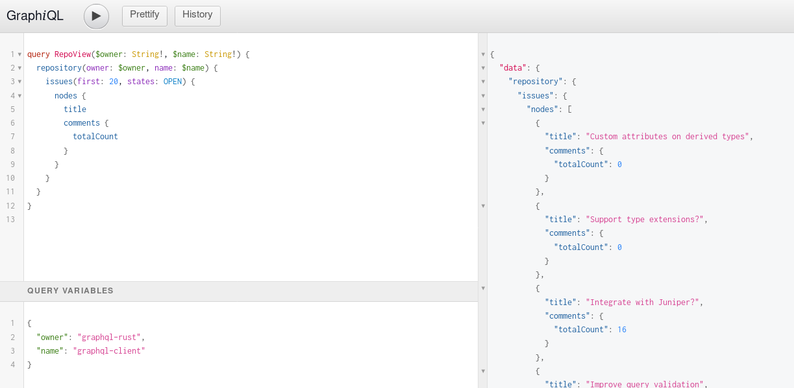
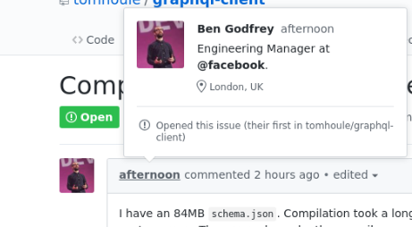

export { swiss as theme } from 'mdx-deck/themes'
import { Split } from 'mdx-deck/layouts'
import { CodeSurfer } from "mdx-deck-code-surfer"

graphql-client

```notes
- name
- first time talking on a meetup
- I want to talk about a small library I started early June
```

---

### Why?

<video
    autoPlay
    loop
    src="./assets/cat-box.mp4"
/>

<div>
no graphql client in Rust
</div>

```notes
- If it fits, I sits
- I like GraphQL
- I had ideas about GraphQL servers
- Noticed there is no client in Rust
```

---

### pure Rust (?)

<!-- no js dependencies -->
<!-- insert line counts with json here -->

```
------------------------------------
 Language                    Lines
------------------------------------
 JSON                        47193
 Rust                         4782
------------------------------------
```

<small>counted with <a href="https://github.com/Aaronepower/tokei">tokei</a></small>

```notes
- even though the line count may suggest otherwise
- you might wonder why there is so much JSON
- let's backtrack a bit
```

---


- A query language and a specification for building APIs
- All the data you need for a view in one request (client-centric)
- Developed at Facebook, open sourced in 2015
- Very rich, growing ecosystem, fast adoption (Github, Shopify, Facebook, Twitter...)

```notes
- Technology for building APIs, with clients requesting data from a servers
- Spec defining two languages, a type system and the behaviour of servers
- One query -> query a graph objecst and fields
- Client-centric
  - Fetch exactly what you need
  - Nesting (post -> comment -> author -> posts)
- Makes it easy to evolve your API
- Transport agnostic, but most of the time JSON over HTTP
```

---

Example





```notes
- You get what you ask for (client-centric)
- Nesting -> you query an object tree
```

---

## Why you want a client library

- Correctness
- Take advantage of behaviour defined in the spec (error handling...)
- Caching
- *Strong typing*

```notes
- It's easy to make wrong requests
- That's a small part of the library
- No caching yet
- Strong typing is what I want to talk about
```

---

## How it works - introspection

- GraphQL is typed
- Introspection is defined by the spec and meant to be used for code generation
- With a GraphQL query and the schema, we can generate a struct for the response shape

```notes
- GraphQL has a type system - defined by the spec so it's shared between all server implementations
- You can ask a server, at runtime, what API it exposes (also in the spec)
- It returns a structured response you can generate code for a client from - think mini-SDK.
- Why you need both query and schema (selection)
```

---

<CodeSurfer
  notes="Prelude: what's the API?"
  lang="rust"
  code={require('!raw-loader!./api_example.rs')}
  showNumbers
  steps={[
    { range: [1, 6], notes: 'Say where your query and your schema are' },
    { range: [8, 8], notes: 'A module gets generated' },
    { range: [10, 17], notes: 'It contains all you need for typed requests and responses with the query' },
    { range: [19, 20], notes: 'You can easily build your query' },
    { range: [19, 24], notes: 'And get the response' },
  ]}
/>

---

### Chapter 1 - Objects

<video
  src='./assets/objects.mp4'
  autoPlay
  loop
/>

---

<CodeSurfer
  notes="Our API - an address book"
  lang="graphql"
  code={require('!raw-loader!./schema.graphql')}
  showNumbers={true}
  steps={[
    { range: [1, 3], notes: 'We first define the root field: QueryRoot' },
    { range: [5, 9], notes: 'The fields can take arguments at any depth' },
    { lines: [6], notes: "Let's start here" },
    { range: [18, 22], notes: "Object types are like structs" },
  ]}
/>

```notes
- Explain query, mutations, subscriptions
```

---


<CodeSurfer
  lang="graphql"
  code={require('!raw-loader!./simple_query.graphql')}
  showNumbers={true}
  steps={[
    { range: [0, 21], notes: 'Request-response' },
    { tokens: { 3: [2] }, notes: 'name the query'},
    { tokens: { 3: [3, 4, 5, 6, 7, 8] }, notes: 'declare variables (parameters)' },
    { range: [4, 8], notes: 'select what we want'},
    { range: [11, 21], notes: 'get what we asked for'},
    { range: [23, 35], notes: 'put it in convenient Rust data structures' },
  ]}
/>

```notes
- Why we have this naming scheme
- Lots of small interesting challenges like that
```

---

<CodeSurfer
  lang="rust"
  notes="how we would use it"
  code={`
fn get_birthday_from_api(name: String) -> Result<Option<Date>, failure::Error> {
  let response = make_request(name)?;
  Ok(response.data.and_then(|data| data.person).and_then(|person| person.birthday))
}
  `}
  showNumbers={true}
/>

---

### Chapter 2 - Unions


---

<CodeSurfer
  notes="Remember our api"
  lang="graphql"
  code={require('!raw-loader!./schema.graphql')}
  showNumbers={true}
  steps={[
    { range: [5, 9], notes: 'Our root fields' },
    { lines: [6], notes: "we just did this" },
    { lines: [7], notes: "let's do that" },
    { lines: [11], notes: "unions are a bit like untagged unions in Rust" },
    { range: [18, 36], notes: "any one of these types" },
  ]}
/>

---

<CodeSurfer
  lang="graphql"
  code={require('!raw-loader!./union_query.graphql')}
  showNumbers
  steps={[
    { range: [0, 26], notes: 'Request-response' },
    { range: [1, 15], notes: 'the query looks different' },
    { range: [6, 13], notes: 'we have to discriminate which fields we select by type'},
    { range: [5, 5], notes: 'we can ask the name of the type we get (introspection)' },
    { range: [17, 26], notes: 'we get what we asked for'},
    { range: [28, 33], notes: 'put it in convenient Rust data structures' },
    { range: [35, 41], notes: 'we have a tag, serde can give us an enum' },
    { range: [43, 51], notes: 'selections on objects work like before' },
  ]}
/>

---

<CodeSurfer
  lang="rust"
  notes="how we would use it"
  code={`
fn get_birthday_from_api() -> Result<(), failure::Error> {
  let response = make_request()?;
  response.data
    .and_then(|data| data.entry)
    .map(|entry| {
      match entry {
        EntryByIdEntry::Person(person) => send_birthday_card(person),
        EntryByIdEntry::Organization(organization) =>
            send_birthday_card_to_members(organization),
        EntryByIdEntry::DeletedEntry =>
            return Err(format_err!("The entry was deleted")),
      }
    });
  Ok(())
}
  `}
  showNumbers={true}
  steps={[
    { range: [7, 13] },
  ]}
/>

---

### Chapter 3 - Interfaces


---

<CodeSurfer
  notes="A new challenger appears"
  lang="graphql"
  code={require('!raw-loader!./schema.graphql')}
  showNumbers={true}
  steps={[
    { range: [5, 9], notes: 'Our root fields' },
    { lines: [6, 7], notes: "we did that" },
    { lines: [8], notes: "let's do the last one" },
    { range: [13, 16], notes: "interfaces are like unions, but..." },
    { range: [14, 15], notes: "they define common fields" },
    { range: [18, 22], notes: "and the members are defined differently" },
    { lines: [18], notes: "and the members are defined differently" },
    { range: [13, 22], notes: "and the members are defined differently" },
  ]}
/>

---

<CodeSurfer
  lang="graphql"
  code={require('!raw-loader!./interface_query.graphql')}
  showNumbers
  steps={[
    { range: [0, 38], notes: 'Request-response' },
    { range: [0, 17], notes: 'Request' },
    { range: [6, 7], notes: 'We can ask for the common fields' },
    { range: [0, 17], notes: 'Otherwise nothing new' },
    { range: [19, 38], notes: 'the response looks like a union response' },
    { range: [40, 100], notes: 'now for the generated code' },
    { range: [42, 45], notes: "It's a non-null array" },
    { lines: [47, 48, 49, 50, 53], notes: "Interfaces are like objects" },
    { range: [55, 60], notes: "Interfaces are also like enums" },
    { range: [47, 53], notes: 'FUUUUUSION!' },
  ]}
/>

```notes
- How do you combine the enum and the struct? You can't... but serde has got us covered
```

---

### Takeaways

- Serde is awesome
- Rust is really good at playing with other languages


```notes
- I don't think I could have done it without all the serde annotations
```

---

### Question to the audience

<video
    autoPlay
    loop
    src="./assets/intermission.mp4"
/>

---

<CodeSurfer
  notes='if a GraphQL query wore pants...'
  lang="rust"
  code={require('!raw-loader!./pants.rs')}
  steps={[
    { range: [1, 10], notes: 'would it wear them like this?'},
    { range: [11, 21], notes: 'or like this?'},
    { range: [1, 21], notes: 'vote' },
  ]}
/>

---

### Conclusion: Learnings

---

### Be prepared for contributors

- Not enough time invested in a CONTRIBUTING.md
- Be ready to comment and review a lot
- I thought the library was ready at 0.1 (wrong)
- Underestimated the work - even for a small project like this
- Shoutout to all those who contributed, and in particular to @h-michael, @LegNeato and @mathstuf


```notes
- Thought it was ready - wrong
- Underestimated the work
```

---

export default Split





---

### Ecosystem

<video
    autoPlay
    loop
    src="./assets/ecosystem_synergy.mp4"
/>

<div>
    <small>Useful crates</small>
</div>

```notes
- Other learning: the ecosystem
- We have a really awesome ecosystem of basic building blocks like serde
- We can build higher-level libraries on top
- In graphql, graphql-parser
```

---

### Error handling - failure

<video
    autoPlay
    loop
    src="./assets/corgi-failure.mp4"
/>


---

### Macros - Cargo expand


---

### Dependencies - cargo-edit

<video
    autoPlay
    loop
    src="./assets/cargo-edit.mp4"
/>

---

### Future

- clients everywhere!
- normalized cache shared between implementations
- build script, CLI and possibly proc macro-based codegen workflows
- codegen as an npm package
- better query validation
- friendlier error messages
- ...

---

<small>halp</small>


---

### Naming

<video
    autoPlay
    loop
    src="./assets/naming.mp4"
/>

---

### Documentation management

<div>


</div>

<!-- ghostbusters opening scene here -->

---

### CLI and build script APIs

```notes
- people with graphql experience: what do you think?
```

---

### Hacktoberfest

---

### Keep in touch

- graphql-client: https://github.com/graphql-rust/graphql-client
- mastodon: [@vache_a_lemmes@eldritch.cafe](https://eldritch.cafe/web/accounts/30706)
- twitter: [@_tomhoule](https://twitter.com/_tomhoule)

---

### Links


- GraphQL guide: https://graphql.org
- [Why you might want a GraphQL client](https://blog.apollographql.com/why-you-might-want-a-graphql-client-e864050f789c)
- [serde.rs](https://serde.rs)
